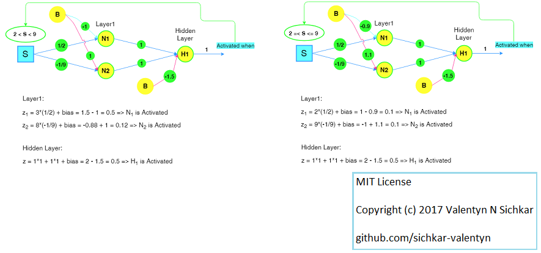
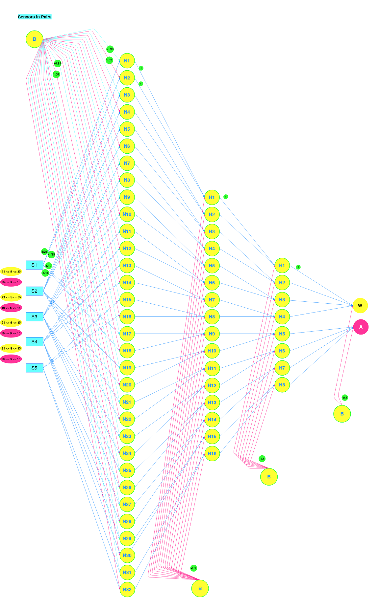
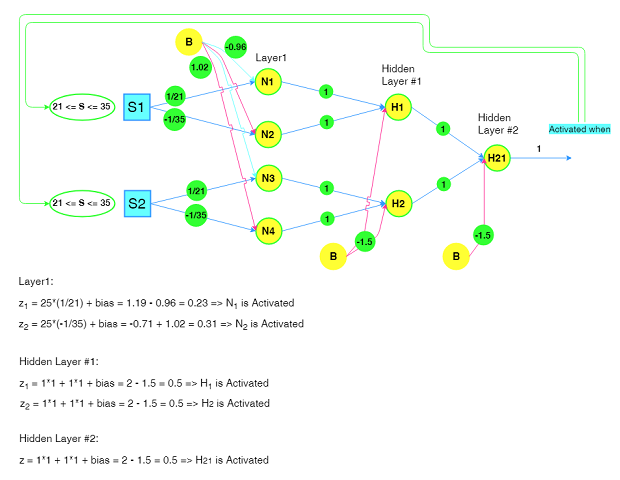
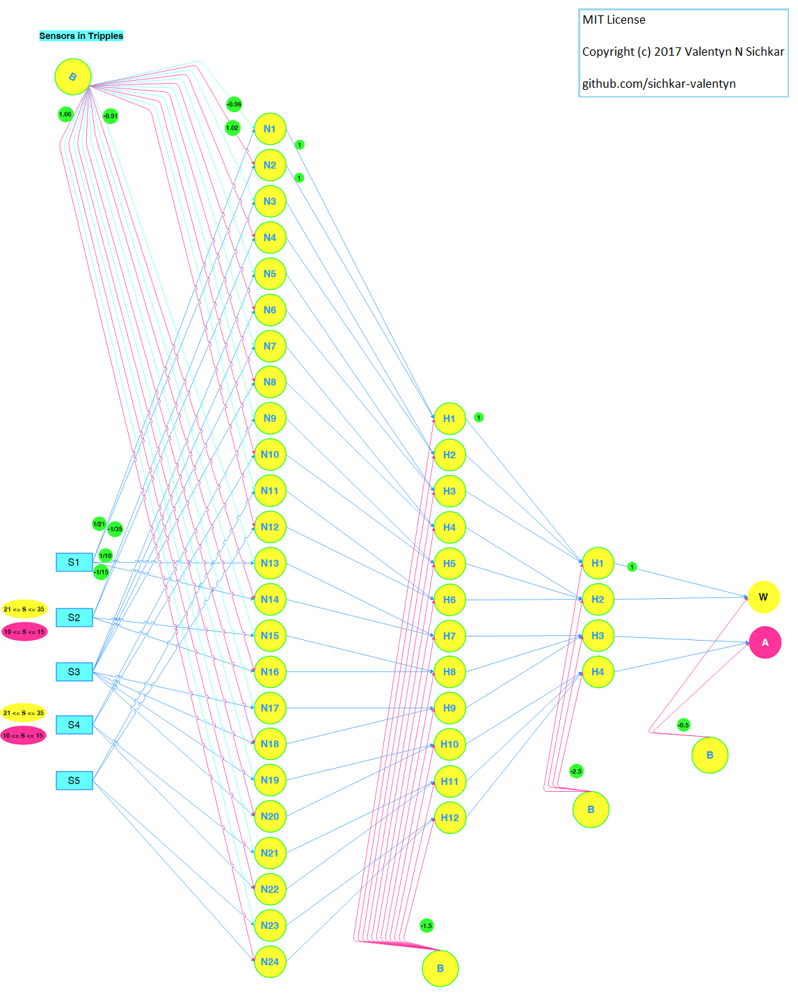
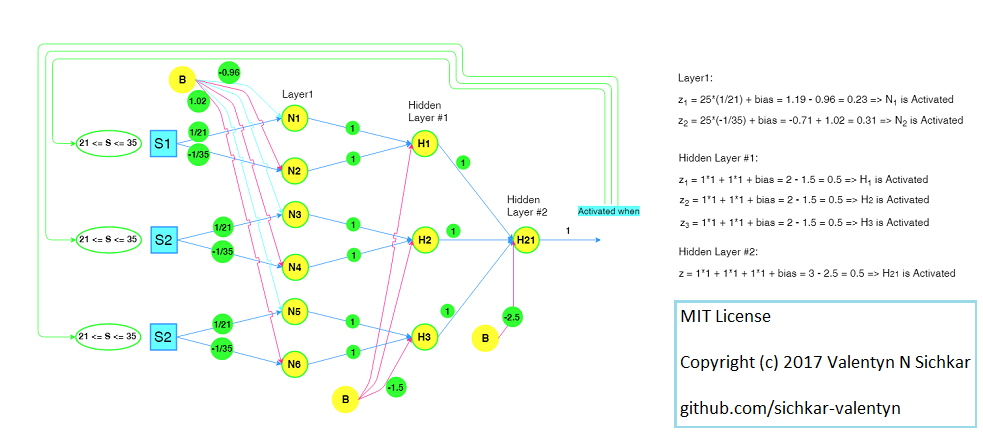
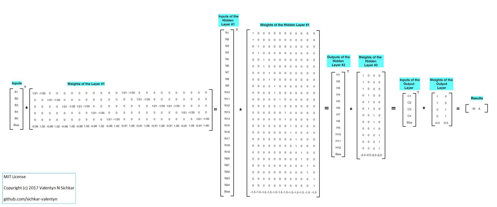
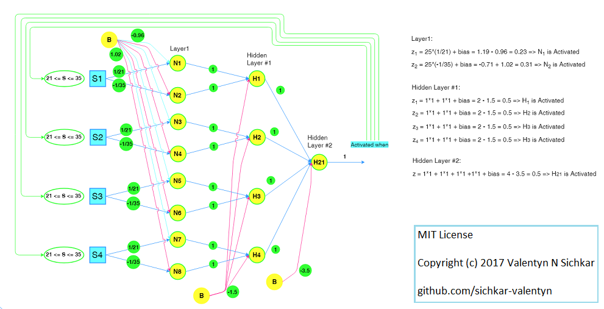
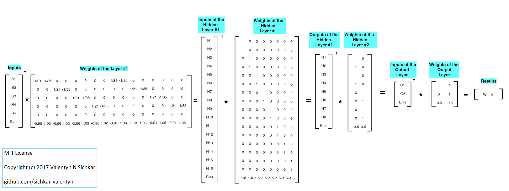
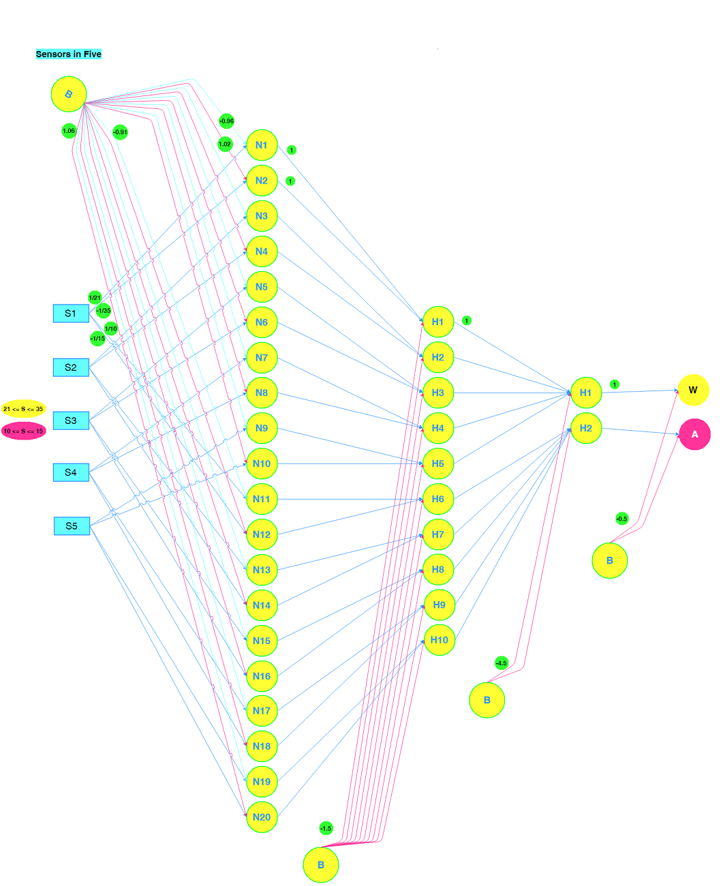
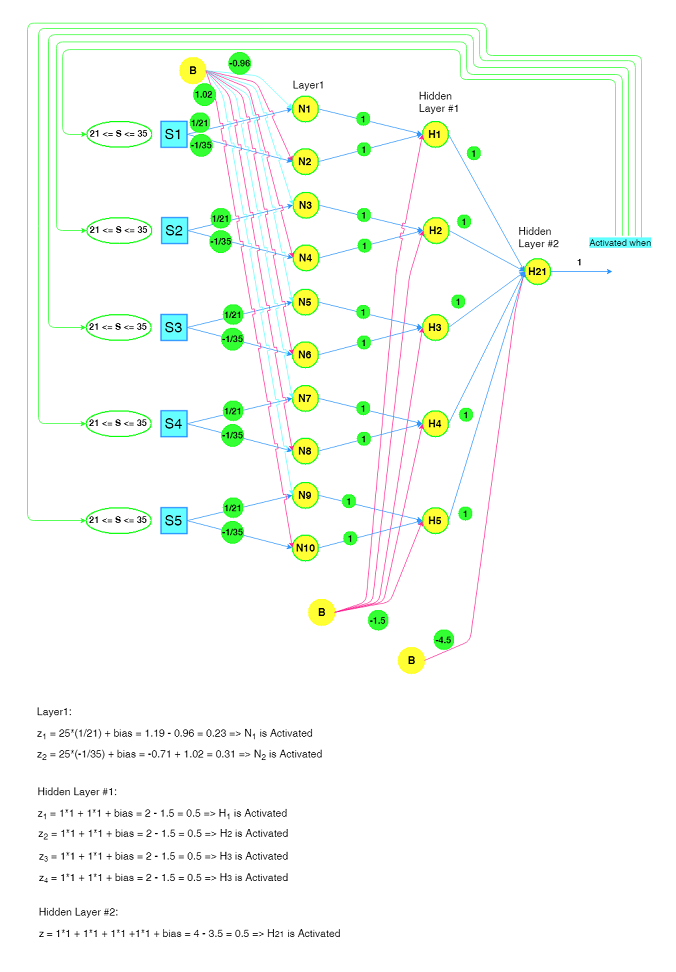

# Matlab Implementation of Neural Networks
Matlab implementation of Neural Networks with computational results for Control System with five Ultrasonic Sensors.
 

### Reference to:
Valentyn N Sichkar. Matlab implementation of Neural Networks Results for Control System of five Ultrasonic sensors // GitHub platform. DOI: 10.5281/zenodo.1317896

### Related works:
* Sichkar V.N. Comparison analysis of knowledge based systems for navigation of mobile robot and collision avoidance with obstacles in unknown environment. St. Petersburg State Polytechnical University Journal. Computer Science. Telecommunications and Control Systems, 2018, Vol. 11, No. 2, Pp. 64–73. DOI: <a href="https://doi.org/10.18721/JCSTCS.11206" target="_blank">10.18721/JCSTCS.11206</a>

* The study of Semantic Web languages OWL and RDF for Knowledge representation of Alarm-Warning System is put in separate repository and is available here: https://github.com/sichkar-valentyn/Knowledge_Base_Represented_by_Semantic_Web_Language

* The study of Semantic Representation of knowledge and querying of it through owl files with SPARQL is put in separate repository and is available here: https://github.com/sichkar-valentyn/System_programming_for_SPARQL_querying_with_interface_development_by_html_files

* The study of Neural Networks for Computer Vision in autonomous vehicles and robotics is put in separate repository and is available here: https://github.com/sichkar-valentyn/Neural_Networks_for_Computer_Vision

## Description
System controls the statements around the object by checking the distances with five Ultrasonic Sensors. The Sensors work <b>Separately</b>, in <b>Pairs</b>, in <b>Triples</b>, in <b>Quad</b> and all <b>Five</b> together. The Neural Networks are implemented for all of these different approaches. Neural Networks show the results in form of <b>"Alarm"</b> and <b>"Warning"</b>. The intervals for each sensor in each communication form are shown in the figures below. The Neural Networks are already adjusted and all Weights and Biases are set. All Neural Networks have the same <b>Input Vector</b> which is the current value of each sensor.

## Content
Code (it'll send you to appropriate file):
* [Matlab Code](https://github.com/sichkar-valentyn/Matlab_implementation_of_Neural_Networks/blob/master/NN_Matrices.m)

 
Experimental results (figures and tables on this page):

* <a href="#An example of the execution in Matlab for input vector [10 10 10 10 10 1]">An example of the execution in Matlab for input vector [10 10 10 10 10 1]</a>
* <a href="#The Neural Network of five ultrasonic sensors working Separately">The Neural Network of five ultrasonic sensors working Separately</a>
* <a href="#Rules for Separate method">Rules for Separate method</a>
* <a href="#The Matrices for Separate method">The Matrices for Separate method</a>
* <a href="#The Neural Network of five ultrasonic sensors working in Pairs">The Neural Network of five ultrasonic sensors working in Pairs</a>
* <a href="#Rules for method in Pairs">Rules for method in Pairs</a>
* <a href="#The Matrices for method in Pairs">The Matrices for method in Pairs</a>
* <a href="#The Neural Network of five ultrasonic sensors working in Triples">The Neural Network of five ultrasonic sensors working in Triples</a>
* <a href="#Rules for method in Triples">Rules for method in Triples</a>
* <a href="#The Matrices for method in Triples">The Matrices for method in Triples</a>
* <a href="#The Neural Network of five ultrasonic sensors working in Quad">The Neural Network of five ultrasonic sensors working in Quad</a>
* <a href="#Rules for method in Quad">Rules for method in Quad</a>
* <a href="#The Matrices for method in Quad">The Matrices for method in Quad</a>
* <a href="#The Neural Network of five ultrasonic sensors working in Five">The Neural Network of five ultrasonic sensors working in Five</a>
* <a href="#Rules for method in Five">Rules for method in Five</a>
* <a href="#The Matrices for method in Five">The Matrices for method in Five</a>

 

## <a name="An example of the execution in Matlab for input vector [10 10 10 10 10 1]">An example of the execution in Matlab for input vector [10 10 10 10 10 1]</a>

 

## <a name="The Neural Network of five ultrasonic sensors working Separately">The Neural Network of five ultrasonic sensors working Separately</a>

 

## <a name="Rules for Separate method">Rules for Separate method</a>

 

## <a name="The Matrices for Separate method">The Matrices for Separate method</a>

 

## <a name="The Neural Network of five ultrasonic sensors working in Pairs">The Neural Network of five ultrasonic sensors working in Pairs</a>

 

## <a name="Rules for method in Pairs">Rules for method in Pairs</a>

 

## <a name="The Matrices for method in Pairs">The Matrices for method in Pairs</a>

 

## <a name="The Neural Network of five ultrasonic sensors working in Triples">The Neural Network of five ultrasonic sensors working in Triples</a>

 

## <a name="Rules for method in Triples">Rules for method in Triples</a>

 

## <a name="The Matrices for method in Triples">The Matrices for method in Triples</a>

 

## <a name="The Neural Network of five ultrasonic sensors working in Quad">The Neural Network of five ultrasonic sensors working in Quad</a>

 

## <a name="Rules for method in Quad">Rules for method in Quad</a>

 

## <a name="The Matrices for method in Quad">The Matrices for method in Quad</a>

 

## <a name="The Neural Network of five ultrasonic sensors working in Five">The Neural Network of five ultrasonic sensors working in Five</a>

 

## <a name="Rules for method in Five">Rules for method in Five</a>

 

## <a name="The Matrices for method in Five">The Matrices for method in Five</a>

 

### MIT License
### Copyright (c) 2018 Valentyn N Sichkar
### github.com/sichkar-valentyn
### Reference to:
Valentyn N Sichkar. Matlab implementation of Neural Networks Results for Control System of five Ultrasonic sensors // GitHub platform. DOI: 10.5281/zenodo.1317896
